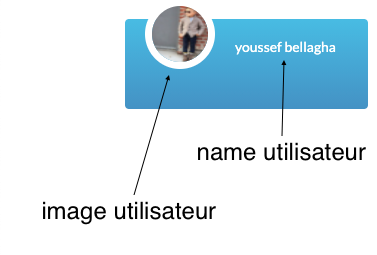

<h1>Manuel d'utilisation du site </h1>
<h2>1-Accès à l’espace privé</h2>

Pour accéder au blog, vous devez d'abord l'identifier, et cela se fait sur la première page

	
    

<h2>2-blog</h2>

	
    

<h3>a- Information utilisateur </h3>

	
    

<h3>b-Déconnexion </h3>

	
    

<h3>c- Zone pour publier un statut</h3>

	
    

<h3>d- les post </h3>

	
    
